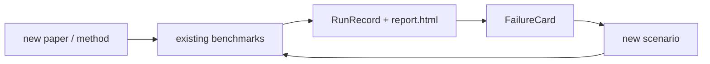

<h1 align="center">autoware-playground</h1>

<p align="center">
  <i>Benchmark-first experimentation overlay for <a href="https://github.com/autowarefoundation/autoware">Autoware</a>.</i>
  <br>
  Plug research methods into Autoware. Compare on the same scenarios, the same maps, the same metrics.
  <br>
  Turn failures into new benchmarks.
</p>

<p align="center">
  <a href="https://github.com/rsasaki0109/autoware-playground/actions"></a>
  <a href="#"></a>
  <a href="#"></a>
  <a href="LICENSE"></a>
</p>

---

## Why

A new planner runs. A new perception net runs. A new VLM driver runs.
Three different repos. Three different scenarios. Three different "it works".

**autoware-playground** is the shared bench:

> Same scenario. Same rosbag. Same map. Same metrics. Same `result.json`.

Research code goes in. Reproducible benchmarks come out. Failures become the next benchmark.

## The Loop



## Four First-Class Objects

| Object         | What it is                                                              | Where it lives                |
|----------------|-------------------------------------------------------------------------|-------------------------------|
| **Experiment** | A research method connected to an Autoware slot (planning, perception…) | `experiments/<task>/<name>/`  |
| **Benchmark**  | One reusable case = scenario + map + metrics + gates + expected fails   | `benchmarks/<task>/<name>/`   |
| **RunRecord**  | The exact output of one experiment on one benchmark, schema-validated   | `runs/<id>/result.json`       |
| **FailureCard**| Structured why-it-failed note that seeds the next benchmark             | `runs/<id>/failure_cards/`    |

## Quickstart

```bash
git clone https://github.com/rsasaki0109/autoware-playground
cd autoware-playground

python3 -m venv .venv
.venv/bin/pip install -e tools/apg

# 1. validate every manifest in the repo
.venv/bin/apg validate .

# 2. dry-run the headline demo (no Autoware needed)
.venv/bin/apg demo lane_change_cut_in --dry-run --headless --report

# 3. open the generated report
xdg-open runs/latest/report.html
```

You should see a `RunRecord`, a `report.html`, and a `failure_cards/sim_invalid.yaml` stub.
Real runners (Autoware + Scenario Simulator v2 + rosbag replay) plug in behind the same manifests.

## CLI

```text
apg validate [path] [--json]   # schema + cross-reference validation
apg lint     [path] [--json]   # strict: warnings become errors
apg list benchmarks | experiments
apg run <benchmark> --experiment <exp> --dry-run [--report]
apg report <result.json | run_dir>
apg compare <left_run> <right_run> [--json]
apg demo lane_change_cut_in --dry-run [--headless] [--report]
```

## What This Is Not

- ❌ a mini Autoware
- ❌ a fork or replacement for Autoware Universe
- ❌ a redefinition of Autoware messages
- ❌ a custom simulator or universal sim abstraction
- ❌ a plugin SDK / dashboard / MLOps platform (in MVP)
- ❌ a place for benchmark-free implementation PRs

Autoware Core and Universe remain the upstream autonomy stack. This repo sits *outside* them.

## Layout

```text
benchmarks/   <task>/<case>/   benchmark.yaml + metrics.yaml + assets.yaml + expected_failures.yaml
experiments/  <task>/<method>/ experiment.yaml + launch/ + params/ + src/
contracts/    slots/...        Autoware slot contracts (planning.motion, localization.pose_estimator, ...)
schemas/                       JSON Schemas for every manifest kind
tools/apg/                     apg CLI (Python)
assets/                        manifests for maps / rosbags / scenarios — never raw data
runs/                          generated; not committed
```

## Adding A Paper Method

1. `experiments/<task>/<method>/` with `README.md`, `experiment.yaml`, `launch/`, `params/`.
2. Read `contracts/slots/<your-slot>.md`.
3. Shadow mode first — publish under `/awpg/experiments/<method>/...`.
4. Run a smoke benchmark. Commit the RunRecord. If it fails, commit the FailureCard.

See `docs/adding_a_paper_method.md` (coming) and `AGENTS.md` for AI-coding-agent rules.

## Adding A Benchmark

1. `benchmarks/<task>/<case>/` with `benchmark.yaml`, `metrics.yaml`, `assets.yaml`, `expected_failures.yaml`, `README.md`.
2. Reference data through `assets/` manifests only (no rosbags / maps / weights in git).
3. Define required gates and diagnostic metrics.
4. Add a baseline `result.json` once a baseline experiment can run it.

## Leaderboard

The current benchmark × experiment table — auto-regenerated by CI on every push to `main` from real `ros2 bag play` runs plus committed baselines — is at:

- [`reports/leaderboard.md`](reports/leaderboard.md) — block-per-benchmark Markdown, readable directly on GitHub.
- [`reports/leaderboard.html`](reports/leaderboard.html) — same table as a styled HTML page; each row links to its `report.html` (or `result.json` when no report exists yet).

## CLI (extras)

```text
apg leaderboard [--format text|markdown|json|html] [--link-base ..]   # benchmark x experiment table
apg leaderboard-diff <base.json> <head.json> [--fail-on-change]       # diff two leaderboard JSON dumps
apg preflight <benchmark> [--runner ...] [--json]  # check env before non-dry-run
```

Tip: write the HTML version with `apg leaderboard --format html --link-base .. > reports/leaderboard.html` so per-row links escape `reports/` and reach `benchmarks/` and `runs/` at the repo root.

`apg leaderboard-diff` powers the **PR regression alert** — every pull request runs `leaderboard-diff` against `main`'s published `reports/leaderboard.json` and writes the result to the smoke job's step summary, so reviewers see at a glance whether the PR moved a benchmark metric, flipped a status, or added/removed a row.

## Status

- ✅ MVP 0.1 scaffold: manifests, schemas, dry-run runner, static report
- ✅ FailureCard schema + auto-stub generation + report linking
- ✅ Real `rosbag_replay` execution (local + CI) and 2 real baselines
- ✅ CI-generated leaderboard committed to `reports/leaderboard.{md,html,json}` (HTML rows link to each `report.html`)
- ✅ PR regression alert: `apg leaderboard-diff` against `main` in the smoke step summary
- 🚧 Real `scenario_simulator_v2` (needs pinned Autoware workspace)
- 🚧 Promote remaining 2 baselines (planning, prediction) to real

See [`plan.md`](plan.md) for the full design, principles, and roadmap.

## License

[Apache-2.0](LICENSE)
